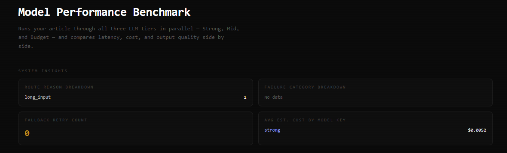
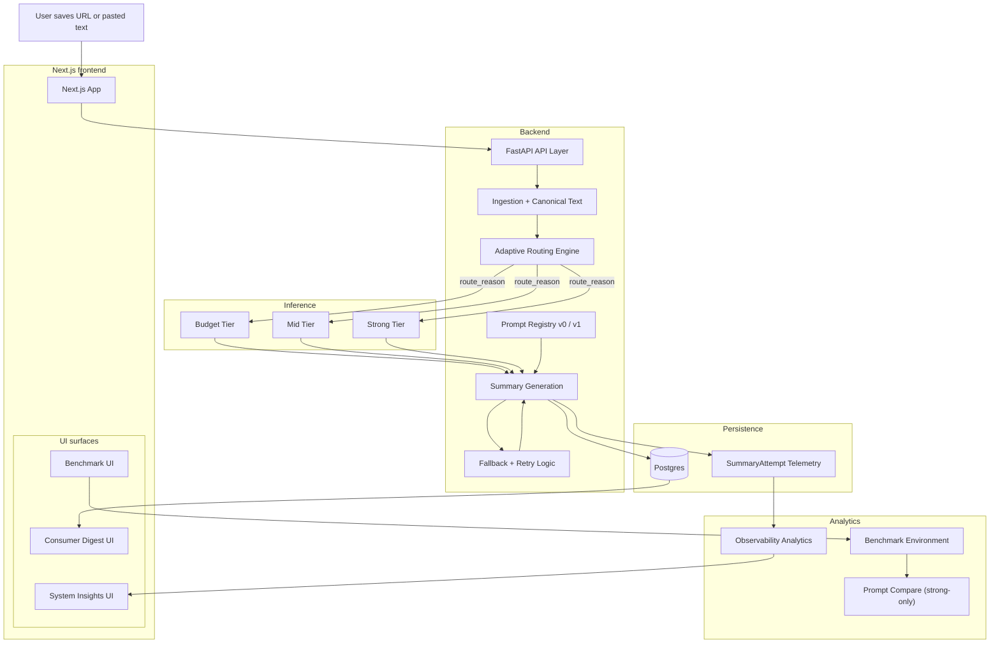
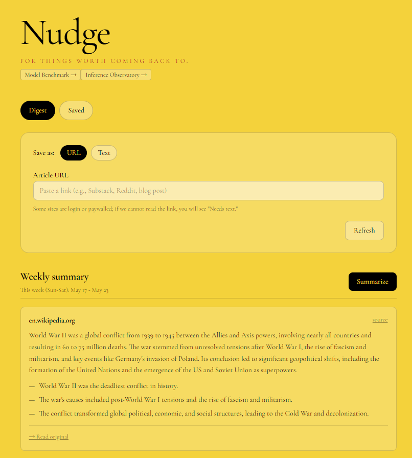
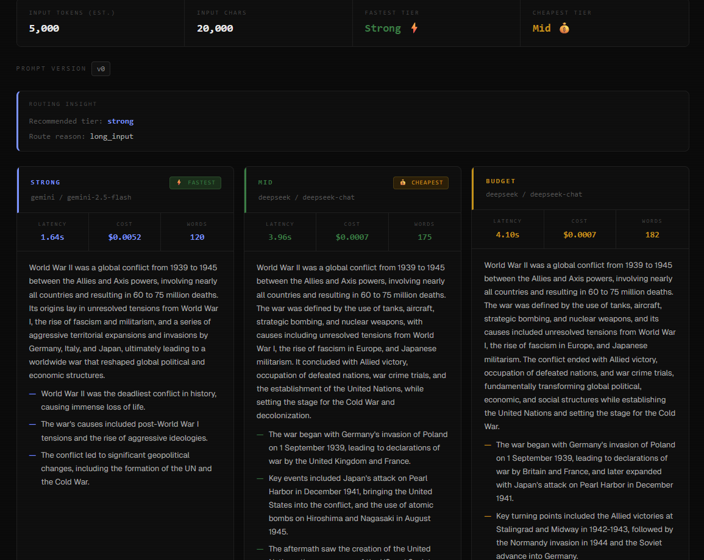
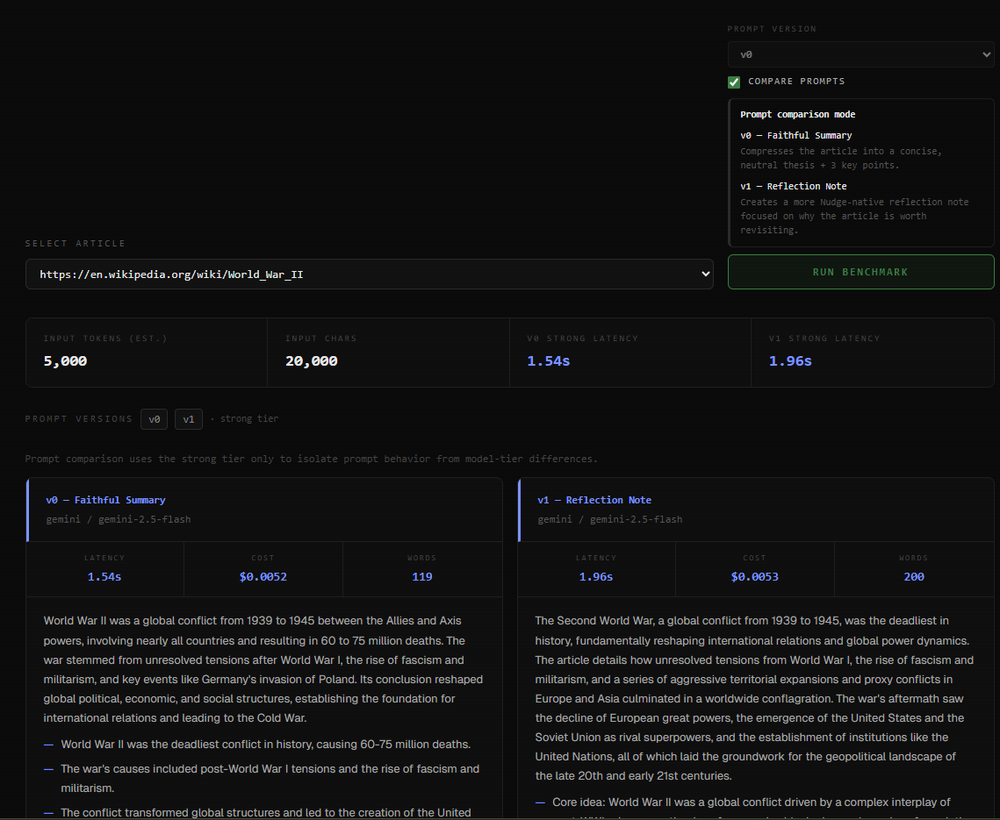

# Nudge

**Nudge is not a summarizer.** It is a **reflective reading companion**: a consumer-facing product and a **production-style AI system** built around saved content, intentional revisitation, and structured reflection—without automating away the thinking.

Most “AI summary” tools optimize for speed and volume. Nudge optimizes for **returning to what you saved**, with AI that **organizes and synthesizes** so you can re-engage originals with context. The product thesis is unchanged: **reflection over automation**—AI should lower friction for revisiting ideas, not replace judgment or deep reading.

---

## Table of contents

- [Positioning](#positioning)
- [Why this project exists](#why-this-project-exists)
- [Problem](#problem)
- [How Nudge helps](#how-nudge-helps)
- [Core product loop](#core-product-loop)
- [AI inference architecture](#ai-inference-architecture)
- [Adaptive routing](#adaptive-routing)
- [Prompt lifecycle & evaluation](#prompt-lifecycle--evaluation)
- [Observability & reliability](#observability--reliability)
- [Benchmark environment](#benchmark-environment)
- [System insights & analytics](#system-insights--analytics)
- [MVP scope](#mvp-scope)
- [How AI is used (MVP)](#how-ai-is-used-mvp)
- [Product philosophy](#product-philosophy)
- [Tech stack](#tech-stack)
- [Architecture (High Level)](#architecture-high-level)
- [Getting started (local dev)](#getting-started-local-dev)
- [What success looks like (MVP)](#what-success-looks-like-mvp)
- [Future roadmap (post-MVP)](#future-roadmap-post-mvp)
- [Screenshots](#screenshots)
- [Resume-ready summary](#resume-ready-summary)
- [Team](#team)

---

## Positioning

Nudge sits at the intersection of:

| Lens | What it means here |
|------|---------------------|
| **Adaptive AI inference** | Requests are routed across **budget / mid / strong** model tiers using deterministic rules and persisted **`route_reason`** metadata. |
| **Prompt evaluation** | Prompts are **versioned** (**v0**, **v1**); a **prompt-compare** flow runs the same content through two prompt contracts on a fixed tier to isolate instruction effects. |
| **Observability-first application** | Summary attempts record latency, cost estimates, routing, failures, and taxonomy-friendly error detail for analytics and debugging. |
| **Product systems** | The same codebase ships a **consumer UX** (save → process → digest) and **internal surfaces** (benchmark UI, analytics insights) for operating the system. |

---

## Why this project exists

Most AI portfolio projects stop at “call an LLM API and render text.”

Nudge was intentionally designed to explore the harder product and infrastructure questions behind production AI systems:

- How should workloads be routed?
- How do prompts evolve safely?
- How should latency and cost be surfaced?
- What observability is needed before scaling features?
- How should failures degrade gracefully?
- How do you evaluate prompt behavior independently from model behavior?

The project evolved from a consumer reflection product into a lightweight AI inference and evaluation platform embedded inside a real UX surface.

---

## Problem

People save articles and posts intending to learn from them later, but most saved content is never meaningfully revisited. Bookmarks behave like passive storage. Without structure or synthesis, ideas disappear into long lists—a gap between what users want to engage with and what they actually reflect on.

---

## How Nudge helps

Nudge closes the gap by:

- Collecting what users save  
- Organizing saved content by topic (embeddings / clustering)  
- Surfacing weekly insights that encourage **deeper engagement** and **nudging users back to original sources** when more context is needed  

Saving is the **start** of a reflection loop, not the end.

---

## Core product loop

1. User saves content into Nudge (link or pasted text).  
2. System processes and stores items during the week.  
3. Items are clustered by topic using embeddings.  
4. A weekly digest is generated with topic clusters, key takeaways, and links to originals.  
5. User **revisits** content they care about, intentionally.  

---

## AI inference architecture

Inference is treated as a **tiered service**, not a single model call:

- **Three tiers** (`budget`, `mid`, `strong`) map to different provider/model configurations for the same task family (e.g. item summarization).  
- **Routing** chooses a tier from input signals (e.g. canonical text length, task type) before generation.  
- **Persistence**: each `SummaryAttempt` ties **outputs** to **routing** (`model_key`, **`route_reason`**), **prompt version**, timing, status, and **estimated serving cost** (`estimated_cost_usd` instrumentation).  

This separates *what we asked the model to do* (prompt version + tier) from *what happened* (latency, success/failure, error taxonomy).

---

## Adaptive routing

Routing is **deterministic** and **explainable** (see `app/llm/routing.py`):

- Example policy dimensions: **task type** (e.g. weekly synthesis vs item summary) and **input length** bands that map to `budget` / `mid` / `strong`.  
- Every routing decision produces a **machine-readable `route_reason`** (e.g. `short_input`, `long_input`, `weekly_synthesis`) stored on attempts for analytics and product tuning.  
- **Fallback orchestration** is visible in telemetry: retries tied to routes whose `route_reason` is prefixed with `fallback_from_`, so ops can measure how often the system escalates or recovers without guessing from logs alone.  

Routing is designed to evolve as telemetry improves; the schema is built to support that iteration.

---

## Prompt lifecycle & evaluation

Prompts are **first-class, versioned artifacts**:

- **v0 — Faithful summary**: neutral distillation, thesis + three key points (see `app/llm/prompts.py`).  
- **v1 — Reflection note**: Nudge-native memory-oriented output focused on why content is worth revisiting.  

**Evaluation workflow**

- **Benchmark (standard)**: runs an article through **all three tiers** in parallel for latency, cost, and output comparison (API + UI).  
- **Prompt comparison**: dedicated **`POST /benchmark/{item_id}/prompt-compare`** runs **only the strong tier** twice—**v0** and **v1**—in parallel, so differences reflect **prompt behavior**, not tier mixing.  

This is intentionally closer to **how teams ship prompts in production**: version, compare, measure, then promote—rather than editing prompts ad hoc.

---

## Observability & reliability

The application records **structured telemetry** on summary attempts, including:

| Capability | Role |
|------------|------|
| **`route_reason` persistence** | Audit trail for *why* a tier was chosen. |
| **Prompt version** | Ties outputs to a specific prompt contract. |
| **Latency & timestamps** | Performance and pipeline debugging. |
| **Serving-cost instrumentation** | `estimated_cost_usd` (approximation) for unit economics and tier comparison. |
| **Failure taxonomy** | Failures can carry **`error_detail`** strings designed for a **`code: message`** prefix pattern; analytics aggregates **categories** from the prefix for reliability dashboards. |
| **Fallback orchestration** | Counts and breakdowns for fallback-style routes support on-call and product review. |

Together, these support an **observability-driven** operating model: ship prompts and routing changes, then verify impact in data—not only in qualitative UI review.

---

## Benchmark environment

The **benchmark** surface (API + Next.js page) is an **internal lab** for the same stack that serves users:

- **Multi-tier benchmark**: `POST /benchmark/{item_id}` with optional `prompt_version` query; compares **strong / mid / budget** on the same truncated canonical text.  
- **Routing insight** (standard benchmark): surfaces **recommended tier** and **route reason** from the same deterministic router used in product flows.  
- **Consumer-grade dark UI** for side-by-side inspection of outputs and metrics.  

### Screenshot (placeholder)

*Add this image path after capturing the benchmark page (multi-tier run with metrics).*

---

## System insights & analytics

**`GET /analytics/`** aggregates per-user **SummaryAttempt** telemetry for lightweight “system health” views in product surfaces (e.g. benchmark page **System Insights**):

- **Route reason breakdown** (counts by `route_reason`; null bucket omitted in UI where it adds noise).  
- **Fallback retry count** (attempts whose `route_reason` starts with `fallback_from_`).  
- **Failure category breakdown** (from `error_detail` prefix before `:`).  
- **Average `estimated_cost_usd` by `model_key`**.  

This is **not** a full BI stack; it is a deliberate **MVP observability panel** that mirrors how small teams start—with SQL-backed aggregates and a thin UI—before standing up full metrics pipelines.

### Screenshot (placeholder)

*Add this image path after capturing the System Insights / analytics cards section.*

---

## MVP scope

**In scope**

- User authentication  
- Save content via article URL (best-effort extraction) or pasted text  
- Background processing pipeline  
- Embedding-based topic clustering  
- Weekly digest UI: topic labels, short summaries, original links  
- View past weekly digests  
- **Tiered inference + routing metadata, prompt versioning, benchmark + prompt-compare, analytics insights (as implemented)**  

**Out of scope (V1)**

- Native mobile apps  
- Share extensions  
- Browser extensions  
- Social features  
- Personalized recommendations  
- Source reputation weighting  
- Multi-modal content (video/audio)  

These remain future extensions after the core reflection loop is validated.

---

## How AI is used (MVP)

**AI is used for**

- Generating text embeddings  
- Grouping saved items by topic  
- Summarizing clusters into key takeaways  
- **Tiered text generation** with explicit routing and prompt versions  

**AI is not used for**

- Ranking content importance in a heavy-handed way  
- Strong normative judgments on behalf of the user  
- Predictive modeling of user behavior (beyond simple routing heuristics)  

The goal is still to **organize and synthesize**, not replace human judgment.

---

## Product philosophy

- **Reflection over automation**: tools should make revisiting easier, not eliminate the thinking.  
- **Intentional revisitation**: the weekly digest and summaries are **on-ramps** back to originals.  
- **Consumer UX focus**: the primary experience must feel calm, legible, and trustworthy—not a developer dashboard wearing consumer clothes.  
- **Honest AI scope**: Nudge does not claim to “know” what matters most; it structures what **you** saved.  

---

## Tech stack

### Frontend

- React / Next.js  
- TypeScript  

### Backend

- FastAPI (Python)  
- Background workers (RQ or Celery)  
- Redis (job queue)  

### Data

- PostgreSQL  
- pgvector for embeddings  

### AI

- OpenAI (embeddings + generation patterns as configured in the codebase)  

---

## Architecture (High Level)

Telemetry captured per attempt:
- latency
- estimated cost
- input/output tokens
- prompt version
- route_reason
- failure taxonomy

*Interpretation:* **Ingestion** produces **canonical text**; **adaptive routing** selects a **budget / mid / strong** path. **Summary generation** uses the **v0 / v1 prompt registry**, calls the **inference tiers**, and persists **SummaryAttempt telemetry** (including **failure taxonomy**). **Fallback + retry** can loop additional generation attempts. **Observability analytics** feeds **System Insights**; **Benchmark UI** flows through **benchmark** then **prompt comparison** surfaces.

---

## Getting started (local dev)

> Setup instructions will be added as services stabilize.  
> Typical layout: run the FastAPI app with PostgreSQL/Redis configured, run worker processes, and start the Next.js frontend with `NEXT_PUBLIC_API_BASE_URL` pointed at the API.  

---

## What success looks like (MVP)

We consider the MVP successful if:

- Users can save content easily  
- Weekly digests are generated reliably  
- Topic clusters are understandable  
- Users say: *“This actually helps me revisit what I saved”*  
- The team can **operate** inference: explain tier choices (`route_reason`), compare prompts (v0 vs v1), and spot failure modes via **taxonomy + analytics**  

Retention and growth optimization are **not** goals for V1.

---

## Future roadmap (post-MVP)

- Native mobile sharing (iOS / Android share flows where feasible)  
- Browser extensions for one-click desktop saving  
- Weekly email digest to reinforce reflection habits  
- Estimated read time for clusters and items  
- Calendar integrations for review time  
- Smarter extraction for dynamic or paywalled pages  
- Long-term interest tracking and trend visualization  
- Personalized recommendations based on saved themes  

Platform support will vary by third-party sharing permissions.

---

## Screenshots

Built to explore adaptive inference routing, prompt evaluation, and observability inside a real consumer AI workflow.

### Consumer Digest Experience

The digest and item flows show clustered topics and synthesized takeaways from saved URLs or notes. This is where the embedding and summarization pipeline meets the user: the architecture only matters if this surface stays trustworthy and skimmable.

### Benchmark Environment

Multi-tier runs compare budget, mid, and strong on the same canonical input with latency and cost-style signals. It is the controlled environment for validating tiered routing and model behavior without relying on ad hoc API calls.

### Prompt Comparison Workflow

Compare mode fixes the **strong** tier and varies **v0 / v1** prompts side by side. That isolates instruction changes from adaptive routing, which is how you ship prompt updates without conflating them with tier or model swaps.

### System Insights Dashboard

Aggregate cards reflect **SummaryAttempt**-backed analytics: route reasons, fallbacks, failure categories, and cost by `model_key`. Keeping this next to the benchmark UI embeds observability in the same workflow engineers and PMs already use to evaluate inference.

---

## Resume-ready summary

- **Product**: Built **Nudge**, a consumer **reflective reading companion**—saved links and notes → topic clustering → weekly digest—positioned against passive bookmarking.  
- **Systems**: Implemented **adaptive tiered inference** (budget/mid/strong) with **persisted `route_reason`**, **fallback-style route telemetry**, and **serving-cost estimates** on summary attempts.  
- **Prompt ops**: Shipped **versioned prompts (v0/v1)**, a **benchmark lab** (multi-tier and **prompt-compare on strong**), and **API-side parallel** prompt evaluation.  
- **Reliability & observability**: **Failure taxonomy** via `error_detail` prefixes, **analytics aggregates** (route breakdown, fallback counts, failure categories, cost-by-tier), and UX surfaces for **System Insights**.  
- **Stack**: Next.js/TypeScript, FastAPI, PostgreSQL/pgvector, Redis workers—**end-to-end AI product** with production-minded instrumentation.  

---

## Team

Built collaboratively by:

- **Product & UX:** Souvik  
- **Backend & data pipeline:** Arpan  

This project focuses on building a real, end-to-end AI product with **production-style system design**—not a demo wrapper around a single chat completion.
